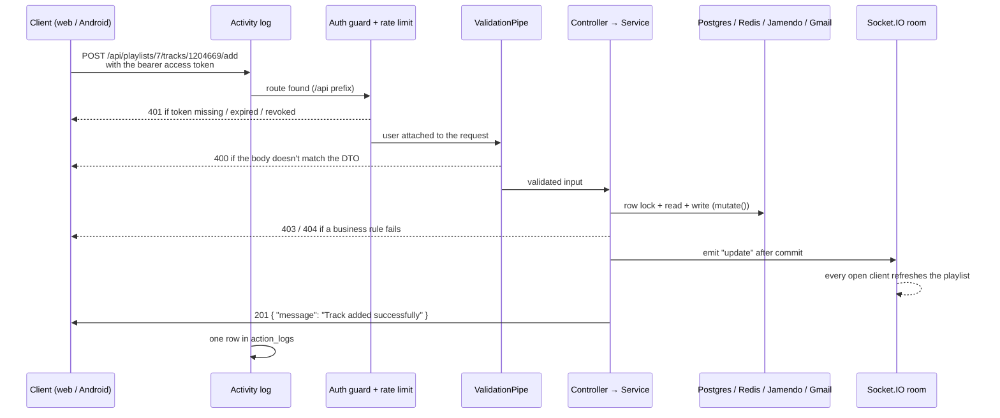

# MusicRoom

Collaborative music app (42 subject). Three things you can do:

- **Events (Music Track Vote)**: people join an event, suggest tracks and vote; the most voted track plays next.
- **Playlists (Music Playlist Editor)**: several people edit the same playlist in real time.
- **Devices (Music Control Delegation)**: let a friend play / pause / skip music on your phone.

All music comes from the free [Jamendo](https://developer.jamendo.com/v3.0) API. We never store audio
files, only Jamendo track ids.

| Part | Stack | Folder | Runs on |
|---|---|---|---|
| Backend API (single source of truth) | NestJS 11, TypeORM, PostgreSQL, Redis, Socket.IO | `Backend-Nest/` | http://localhost:8000 |
| Web app | Next.js 16, React 19, Tailwind v4 | `web/` | http://localhost:3000 |
| Mobile app | Kotlin, Jetpack Compose, Hilt, Media3 | `App/` | Android 7+ (minSdk 24) |
| Docs | Animated request-flow explorer | `docs/request-flow.html` | open in any browser |

---

## 1. How the pieces fit

```
  Android app ──┐                      ┌──> PostgreSQL (all data)
                ├── HTTP /api/... ───> │
  Web app ──────┘   JWT bearer         │    NestJS  ──> Redis (1 h cache of Jamendo responses)
                                       │      │
  Web app ───── Socket.IO (playlists) ─┘      └──> Jamendo API (tracks, artists, audio URLs)
                                                    Gmail SMTP (verification + reset mails)
```

- Both clients talk to the **same** REST API, prefixed with `/api`.
- Audio is streamed by the client **directly from Jamendo** (`track.audio` URL); the backend never proxies sound.
- The backend saves only ids (e.g. `playlist.tracks = ["1204669", ...]`) and asks Jamendo for track
  details when a client requests them.

---

## 2. Quick start

Either way, first create the **one** env file of the repo, `.env` at the root, from `.env.example`
(`cp .env.example .env`) and fill in `SECRET_KEY`, `JAMENDO_CLIENT_ID` and the mail settings (see
the table below). There are no env files inside `Backend-Nest/` or `web/`.

**Option A: everything in Docker** (only Docker needed, nothing installed on your machine):

```sh
make up        # = docker compose up -d --build --wait : db, redis, adminer, backend :8000, web :3000
make logs      # follow all logs
make down      # stop everything (data stays in the postgres_data volume)
```

Port 8000 or 3000 already taken (for example by `make dev`)? Run
`API_PORT=18000 WEB_PORT=13000 make up`. The web app is rebuilt to call the new API port.
After changing backend or web code, run `make up` again to rebuild.

**Option B: backend and web on your machine, with hot reload** (needs Node 24 and GNU make;
on Windows use Git Bash or WSL):

```sh
make install   # npm ci for backend + web, creates .env from .env.example if missing
make dev       # Postgres + Redis in Docker, then backend (:8000) and web (:3000) with hot reload
```

`.env` uses the Docker names `db` and `redis`. `make dev` / `make backend` override `DATABASE_URL`,
`REDIS_URL` and `PORT` so a backend on your machine uses `localhost:5433` / `localhost:6379` / `8000`
instead, so the same `.env` works for both options. Run the backend through `make`, not a bare
`npm run start:dev`.

| URL | What |
|---|---|
| http://localhost:3000 | Web app |
| http://localhost:8000/swagger | **API docs**: every endpoint, with example request, response and errors |
| http://localhost:8081 | Adminer DB browser (server `db`, user `postgres`, password `postgres123`, db `musicroom`) |

Other targets: `make deps` (Docker only), `make backend`, `make web`, `make down`, `make logs`.

**Android**: open `App/` in Android Studio (JDK 17), or `make app-build`. You need
`App/app/google-services.json` (not in git, ask a teammate). On the login screen, the **gear icon**
lets you change the backend URL without rebuilding:
- emulator → `http://10.0.2.2:8000`
- real phone → `http://<your PC's LAN IP>:8000` (same Wi-Fi; the compiled default is a teammate's IP)

### Environment variables

All in the root `.env` (template: `.env.example`). Who reads it: docker-compose (backend container +
web build args), the backend on the host (`ConfigModule`, `envFilePath: "../.env"`), and the web app on
the host (`web/next.config.ts`, `NEXT_PUBLIC_*` keys only). A value containing `$` must be wrapped in
single quotes (`SECRET_KEY='abc$def'`), otherwise docker-compose expands it.

| Variable | What it is |
|---|---|
| `DATABASE_URL` | `postgresql://postgres:postgres123@db:5432/musicroom` (Docker name; `make dev` swaps in localhost:5433) |
| `REDIS_URL` | `redis://redis:6379/1` (same idea, localhost:6379 on the host) |
| `SECRET_KEY` | Signs every JWT. Any long random string |
| `JAMENDO_CLIENT_ID` | Free key from https://devportal.jamendo.com. **Without it, no music loads** |
| `DEFAULT_API_URL` | Base URL put in verification e-mails. Must be reachable from the device that opens the mail |
| `EMAIL_HOST_USER` / `EMAIL_HOST_PASSWORD` | Gmail address + [app password](https://myaccount.google.com/apppasswords) used to send mails |

| `NEXT_PUBLIC_API_URL` | Address the **browser** uses for the API: `http://localhost:8000/api`. Baked into the web build |
| `NEXT_PUBLIC_GOOGLE_CLIENT_ID` | Google **Web** OAuth client ID (not the Android one) |
| `API_PORT` / `WEB_PORT` | Optional: published Docker ports (default 8000 / 3000) |

> Tip: no mail configured? Open Adminer, table `users`, and set `isActive` + `isVerified` to
> `true` for your account so you can log in.

---

## 3. Backend (`Backend-Nest/`)

### Folder map

```
src/
  main.ts               bootstrap + Swagger setup
  configure-app.ts      CORS, validation pipe, /api prefix (shared with e2e tests)
  app.module.ts         wires every module + the global JWT guard + activity log
  auth/                 register, login, tokens, e-mail verification, password reset, Google, profile, subscription
  users/                User entity, profiles + privacy, friends, simulated payment (subscription.ts)
  events/               Music Track Vote: events, attendees, roles, votes, invites
  playlists/            Music Playlist Editor: playlists, collaborators, invites + Socket.IO gateway
  music/                JamendoService (HTTP + Redis cache) and the /music proxy routes
  devices/              Music Control Delegation: devices, delegates, queued playback commands
  home/                 one call that builds the whole home screen
  activitylog/          middleware that logs every request (user, platform, device, app version)
  mail/                 nodemailer wrapper
  utils/api-docs.ts     @ApiDoc() helper for Swagger
test/                   e2e suite + JMeter load test plan
```

Each feature follows the Nest pattern: `*.controller.ts` (routes) → `*.service.ts` (logic) →
`*.entity.ts` (TypeORM table) + `dto/` (validated request bodies).

### What happens to a request

> **See it animated:** open [`docs/request-flow.html`](docs/request-flow.html) in a browser. Pick any of
> the 88 endpoints (or a scenario such as "Vote on the next track") and watch the request cross each
> stage below, hit the database / Redis / Jamendo / Gmail / Socket.IO, and come back. You can also
> replay it with an error (401, 400, 403, ...) to see where each one is thrown.
> The page is a snapshot; Swagger stays the source of truth.



1. **`/api` prefix**: the mobile app hard-codes `/api/<resource>/...` paths.
2. **`JwtAuthGuard` (global)**: every route needs `Authorization: Bearer <access token>` unless it is
   marked `@Public()`. Public routes still read the token if present, so "public" detail pages can
   still tell whether you are the owner.
3. **`ValidationPipe`**: request bodies are checked against the DTO classes (`class-validator`);
   unknown fields are dropped; failures → `400` with `message: string[]`.
4. **Controller → Service**. Errors are thrown as Nest exceptions and come back as
   `{ statusCode, message, error }`.
5. **`ActivityLogMiddleware`**: after the response, writes a row to `action_logs` (the subject
   requires a log of every mobile action). The Android app sends `X-Platform`, `X-Device-Model`,
   `X-App-Version` headers for this.

Auth routes (`/api/users/login`, password reset, etc.) are also rate-limited to **5 requests/min/IP**
(`ThrottlerGuard` on `AuthController` only).

### Auth & tokens

```
POST /api/users/create          -> account created, inactive, verification mail sent
GET  /api/users/verify-email    -> (link in the mail) account active
POST /api/users/login           -> { user, tokens: { access (60 min), refresh (7 days) }, message }
POST /api/users/token/refresh   -> new token pair (body: { refresh_token })
POST /api/users/logout          -> revokes ALL tokens of that user
```

- Tokens are JWTs signed with `SECRET_KEY`, containing `sub` (user id), `type` (`access`/`refresh`)
  and `ver` (the user's `tokenVersion`). Logout increases `tokenVersion`, so every older token stops
  working. No blacklist table.
- Google login: the client gets a Google token and sends it to `POST /api/users/social-login`; the
  backend checks it with Google and creates the account (or links it by e-mail) if needed.
- A few auth bodies use **snake_case** keys because that is what the Android app sends:
  register (`full_name`, `username`), refresh/logout (`refresh_token`), social login (`access_token`)
  and profile update (`date_of_birth`, `phone_number`, ...). Swagger shows the exact keys.
- Password reset is 3 steps: `password-reset` (6-digit OTP by mail, valid 10 min) →
  `password-reset-verify-otp` → `password-reset-confirm`.

### Business rules worth knowing

**Event roles**: `owner` (all rights), `editor` (edit, add/remove tracks, invite attendees),
`listener` (vote). Stored as `event.userRoles = { "<userId>": "<role>" }`.
**Who can vote** = the event's vote license: `everyone`, `invited_only` (attendees only), or
`time_window` (attendees, between `HH:MM` and `HH:MM`). Tracks are returned sorted by votes.

**Playlist access**: the owner can do everything; collaborators and users in `couldEdit` can edit
tracks; followers of a public playlist also become collaborators. Private playlists are only visible
to the owner, collaborators and followers, and joining one requires an invite.

**Free vs Premium** (`users/subscription.ts`): free users can own at most **3 playlists** and **3 events**,
all public. Premium (4.99 €/month, **simulated** checkout: card validated with Luhn, nothing is
charged, only brand + last 4 digits are stored; `4000 0000 0000 0002` is always declined) removes the
limits and allows private playlists/events.

**Profile privacy**: `profilePrivacy`, `emailPrivacy`, `phonePrivacy` = `public` | `friends` | `private`.
"Friends" is one-directional: adding someone as a friend lets **them** see **your** friends-only fields.

**Invites / notifications**: event and playlist invites are stored on the invited user
(`eventNotifications`, `playlistNotifications`) and shown via `GET /api/home`.

**Device delegation**: a phone registers itself (`POST /api/devices/register`), the owner delegates it
to a friend by e-mail, the friend sends `play|pause|skip`, and the phone polls
`GET /api/devices/:deviceId/pending-commands` to execute them.

### Real time (playlists)

Socket.IO gateway at the server root (not under `/api`):

```js
io("http://localhost:8000", { query: { playlistId, token: accessToken }, transports: ["websocket"] })
  .on("update", ({ event, tracks, trackId }) => { /* event: track_added | track_removed | tracks_reordered */ });
```

The connection is refused if the token is invalid or the user can't view the playlist. Broadcasts are
sent **after** the DB transaction commits.

The Android app (`PlaylistRealtimeClient.kt`) speaks the same protocol over a plain OkHttp WebSocket
on `/socket.io/?EIO=4&transport=websocket&playlistId=..&token=..`: it answers the open packet `0` with
`40`, the ping `2` with `3`, and treats every `42[...]` frame as an update.

### Database & concurrency

- `synchronize: true`: TypeORM creates/updates tables from the entities on startup. **There are no
  migrations**: change an entity, restart, and the table is updated. Be careful when you rename or
  remove a column, because its data is dropped.
- Renaming a table or column? Do it with `ALTER TABLE ... RENAME` in the database first, then change the
  entity. Changing only the entity makes `synchronize` create a new, empty table / column.
- Lists like votes, roles, tracks and invites are `jsonb` columns. Every write on an event/playlist goes
  through `mutate()`, which takes a row lock (`SELECT ... FOR UPDATE`) in a transaction, so two
  people voting at the same time can't overwrite each other. **Use `mutate()` for any new write.**

### Jamendo + Redis

`music/jamendo.service.ts` is the only place that calls Jamendo. Responses are cached in Redis for
1 hour (except random songs). Jamendo sometimes returns an empty result by mistake, so the service
retries up to 3 times and never caches an empty answer. If Redis is down, it just calls Jamendo
directly.

### Adding an endpoint (checklist)

1. Add the method in the service (throw `NotFoundException`, `ForbiddenException`, etc. for errors).
2. Add the route in the controller. Add `@Public()` if it must work without login.
3. Request body → a DTO class in `dto/` with `class-validator` and `@ApiProperty({ example })`.
4. Document the response: `@ApiDoc('Summary', exampleResponse, { status: 201, errors: { 403: '...' } })`.
5. Write writes through `mutate()` if they touch an event or playlist.
6. Add a test (`*.spec.ts` for logic, `test/app.e2e-spec.ts` for a full flow).

---

## 4. Web app (`web/`)

```
app/
  (auth)/               login, register, forgot-password       (no sidebar)
  (app)/                every logged-in page; layout.tsx redirects to /login if not authenticated
    page.tsx            home
    events/, events/[id]/, playlists/, playlists/[id]/, artists/[id]/, search/, devices/, profile/
components/             UI pieces (cards, Sidebar, Topbar, NowPlayingBar, EventManagePanel, ...)
lib/
  api.ts                THE API client: every backend call is a function on `api`
  types.ts              TypeScript types of the API responses
  auth-context.tsx      current user, login/logout (useAuth())
  player-context.tsx    global audio player: queue, play/pause, seek (usePlayer())
```

- **Calling the API**: always add a function to `api` in `lib/api.ts`, never call `fetch` from a page.
  `request()` adds the bearer token, refreshes the token automatically on a `401` and retries once,
  and throws `ApiError(status, message)` on failure.
- Tokens are stored in `localStorage` (`musicroom_token`, `musicroom_refresh`).
- Live playlist updates: `app/(app)/playlists/[id]/page.tsx` opens the Socket.IO connection.
- Audio: one `<audio>` element in `player-context.tsx`, fed with Jamendo's `track.audio` URL.
- ⚠️ Next.js 16 has breaking changes compared to older versions. Read `web/AGENTS.md` and the docs
  in `node_modules/next/dist/docs/` before relying on old Next.js habits.

---

## 5. Mobile app (`App/`)

```
app/src/main/java/com/example/musicroom/
  MusicRoomApplication.kt    Hilt application, NetworkConfig.init()
  AppEntryPoint.kt           Activity + top-level navigation (splash, onboarding, auth, home, player, ...)
  data/
    network/NetworkConfig.kt base URL (compiled default + runtime override), device headers, websocket URL
    auth/TokenManager.kt     access/refresh tokens in EncryptedSharedPreferences, sessionExpired flow
    auth/GoogleAuthUiClient  Google sign-in
    service/*ApiService.kt   one class per backend area (Auth, Events, Playlist, Music, Home, Device, ...)
    service/MusicPlayerService.kt  Media3 / ExoPlayer playback
    models/                  data classes matching the API JSON
  presentation/<feature>/    Compose screens + ViewModels (auth, home, events, playlist(s), music, player, profile, devices, settings)
  di/AppModule.kt            Hilt providers
```

- Architecture: **Compose screen → ViewModel (Hilt) → ApiService → backend**.
- HTTP is mostly done with `HttpURLConnection` + `org.json` (Retrofit is a dependency but not really
  used). **Every request must call `NetworkConfig.applyDeviceHeaders(connection)`** so the backend
  activity log gets the platform/device/version.
- A `401` on an authenticated call triggers `TokenManager.sessionExpired` → back to login.
- Navigation: `AppEntryPoint.kt` (outer graph) and `presentation/mainHomeScreen/MainDashboard.kt`
  (bottom tabs: home, events, playlist, profile).
- Several `.md` files and stray files at the root of `App/` (`AUTHENTICATION_README.md`,
  `ForgotPasswordScreen.tsx`, ...) are old notes and leftover files. They are not part of the build.

---

## 6. Tests & CI

```sh
make test      # backend unit + e2e, and web unit tests
make app-test  # Android JVM unit tests
```

- **Backend** (Jest): unit tests next to the code (`src/**/*.spec.ts`), and an e2e suite
  (`test/app.e2e-spec.ts`) that boots the real app against a separate `musicroom_test` database
  (created automatically), with only e-mail and Jamendo faked. It covers auth and token revocation,
  privacy, visibility, vote licenses and concurrent votes/joins/edits.
- **Web** (`node --test`): the API client (e.g. token refresh retry).
- **Load test**: JMeter plan in `Backend-Nest/test/performance/jmeter/`, results in `PROJECT_STATUS.md` (V.7).
- **CI** (`.github/workflows/ci.yml`) runs on every push: backend typecheck + tests, web lint +
  typecheck + tests + build, Android unit tests (only when the `GOOGLE_SERVICES_JSON` repo secret is set).

---

## 7. Known gaps & gotchas

- The mobile app has no Friends screen yet (manage friends from the web profile page).
- Only Google social login; no Facebook (the subject accepts either).
- No "recently played" tracking: the home screen's `recentlyListened` is random songs for now.
- Verification mails link to `DEFAULT_API_URL`, so `localhost` links won't open from a phone.
- `synchronize: true` is for development only (see Database section).

Requirement-by-requirement status against the subject: **`PROJECT_STATUS.md`**.
